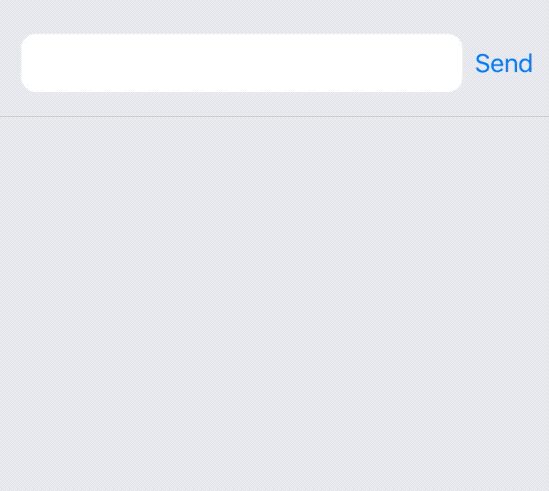

# Growing text view in SwiftUI

If you are planning to write a messaging feature or you are just a SwiftUI enthusiast, this repository can be interesting for you. SwiftUI doesn't provide us the equivalent of UITextView, so to use it in SwiftUI, you need to write a wrapper. Additionally, UITextView can't have a placeholder. I've made a component that can have a placeholder and grow to a predefined height. I hope that this piece of code will help in your SwiftIU adventure.

# [License](LICENSE)
